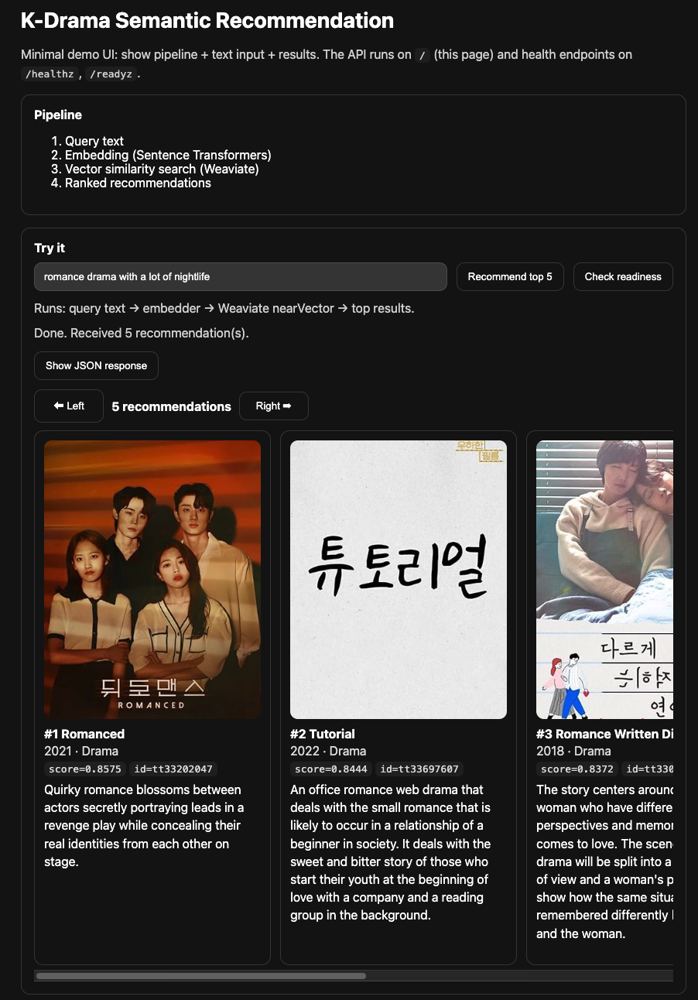

# K-Drama Semantic Recommendation System

Semantic search and recommendation for K-dramas using:
- **Sentence Transformers** for embeddings
- **Weaviate** for vector storage/retrieval
- **Go (Fiber)** for API + web serving
- **Python** for data and ML pipeline

## Overview

The system converts drama metadata and descriptions into embedding vectors, stores them in Weaviate, and returns top recommendations for a free-text query.

End-to-end flow:
1. Collect and filter candidate title IDs
2. Enrich metadata from API
3. Clean text and create embedding input
4. Build vectors with Sentence Transformers
5. Import vectors + metadata into Weaviate
6. Query text -> embedder -> nearVector search -> top results in UI

## Project Structure

```text
├── cmd/
│   ├── api/                      # Go Fiber API (health, recommend, static UI)
│   └── ingest/                   # Optional Go ingest entrypoint scaffold
├── config/
│   ├── example.env               # Local runtime env template
│   └── README.md
├── data/
│   ├── raw/                      # Raw downloaded data
│   ├── processed/                # JSONL, cleaned rows, embeddings, id lists
│   └── README.md
├── deploy/
│   ├── docker-compose.yml        # Weaviate + API + embedder
│   ├── Dockerfile.api            # Go API image
│   ├── Dockerfile.embedder       # Python embedder image
│   └── README.md
├── internal/                     # Shared Go packages (as project grows)
├── notebooks/
│   ├── essay1_word_embeddings.ipynb
│   └── essay2_recommender_systems.ipynb
├── python/
│   ├── ingest/                   # ID building + metadata enrichment
│   ├── preprocess/               # Cleaning + embedding text construction
│   ├── embed/                    # Embedding build + query embedder service
│   ├── index/                    # Weaviate schema + import scripts
│   ├── requirements.txt
│   └── README.md
├── web/
│   └── static/                   # Minimal browser UI
├── go.mod
└── README.md
```

### Docker Runtime Structure

`docker compose` starts these services:
- `weaviate` -> vector database (`localhost:8080`)
- `embedder` -> Python embedding service (`localhost:8000`)
- `api` -> Go Fiber app + UI (`localhost:8081`)

## Notebooks

Notebooks are stored in `notebooks/`:
- `essay1_word_embeddings.ipynb`  
  Practical embedding analysis (vector properties, cosine similarity, semantic neighborhoods).
- `essay2_recommender_systems.ipynb`  
  Recommender-focused analysis (content-based retrieval behavior, anchor evaluations, interpretation).

Both notebooks are aligned with the implemented pipeline and use project outputs from `data/processed/`.

## Runbook: From Data to Browser UI

### 0) Prerequisites

- Docker / Docker Compose installed
- Python 3.10+ and `uv` installed
- Run commands from repository root

### 1) Python Environment Setup

```bash
uv venv
uv pip install -r python/requirements.txt
```

### 2) Data Collection and ID Filtering

> Optional: You can skip this step if you use the dataset files already present in `data/processed/`.
> Run this step again only when you want to refresh or change the source data.

Build K-drama candidate IDs (TSV + API validation pipeline):

```bash
uv run python python/ingest/fetch_id_list.py \
  --raw-dir data/raw/imdb \
  --output data/processed/kdrama_ids.txt \
  --download-missing
```

Enrich metadata for a first test run:

```bash
uv run python python/ingest/enrich_titles.py \
  --ids-file data/processed/kdrama_ids.txt \
  --output data/processed/kdramas.jsonl \
  --limit 10
```

For full run after validation:

```bash
uv run python python/ingest/enrich_titles.py \
  --ids-file data/processed/kdrama_ids.txt \
  --output data/processed/kdramas.jsonl \
  --limit 0
```

### 3) Preprocessing

> Optional: You can skip this step if `data/processed/kdramas_clean.jsonl` already matches your current data.
> Re-run this step whenever the enriched source data changes.

```bash
uv run python python/preprocess/clean.py \
  --input data/processed/kdramas.jsonl \
  --output data/processed/kdramas_clean.jsonl
```

### 4) Build Embeddings

> Optional: You can skip this step if `data/processed/kdramas_embeddings.jsonl` and
> `data/processed/kdramas_embeddings_manifest.json` already match your current cleaned data.
> Re-run this step whenever `kdramas_clean.jsonl` or embedding model settings change.

```bash
uv run python python/embed/build_embeddings.py \
  --input data/processed/kdramas_clean.jsonl \
  --output data/processed/kdramas_embeddings.jsonl \
  --manifest data/processed/kdramas_embeddings_manifest.json
```

### 5) Start Docker Services

```bash
docker compose -f deploy/docker-compose.yml up -d --build
```

### 6) Create Weaviate Schema and Import Objects

```bash
uv run python python/index/create_schema.py --class-name KDrama
```

```bash
uv run python python/index/import_objects.py \
  --clean-input data/processed/kdramas_clean.jsonl \
  --embeddings-input data/processed/kdramas_embeddings.jsonl \
  --class-name KDrama
```

### 7) Verify Import

```bash
curl -s http://localhost:8080/v1/graphql \
  -H "Content-Type: application/json" \
  -d '{"query":"{ Aggregate { KDrama { meta { count } } } }"}'
```

### 8) Open UI and Test

- Open: `http://localhost:8081`
- Enter query text (e.g. `Rugrats` or `romantic drama with emotional storyline`)
- Click **Recommend top 5**

### Web UI Preview



## API Endpoints

- `GET /healthz` -> API process health
- `GET /readyz` -> API + Weaviate readiness
- `POST /api/recommend` -> query-based recommendations

Example:

```bash
curl -s http://localhost:8081/api/recommend \
  -H "content-type: application/json" \
  -d '{"query":"romantic drama with emotional storyline","k":5}'
```

## Tech Stack

- Go + Fiber
- Python + Sentence Transformers
- Weaviate
- Docker Compose
- NumPy / Pandas / Jupyter

## Next Improvements

- Better K-drama filtering and larger clean corpus
- Richer evaluation metrics and benchmark notebook outputs
- Caching and structured observability
- Improved UI interactions and result explainability